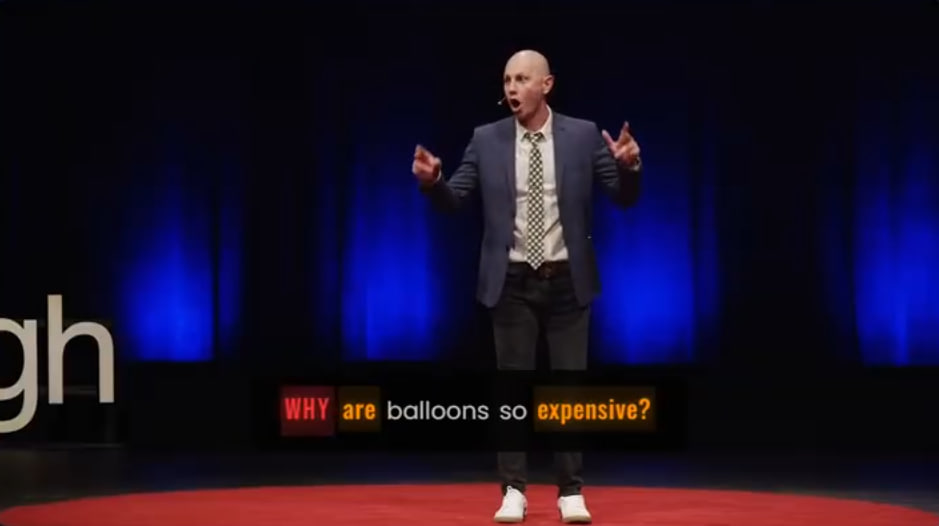

# Sentimentogram: Interpretable Multimodal Speech Emotion Recognition with VAD-Guided Attention and Emotion-Aware Typography Visualization

[](https://www.python.org/downloads/)
[](https://pytorch.org/)
[](https://opensource.org/licenses/MIT)
[](https://2026.aclweb.org/)

**State-of-the-art interpretable Speech Emotion Recognition (SER)** using multimodal fusion of text (BERT) and audio (emotion2vec) features with **four novel contributions**:
1. 🎯 VAD-Guided Cross-Attention
2. ⚖️ Constrained Adaptive Fusion
3. 🔗 Hard Negative Mining MICL
4. 🎨 **Emotion-Aware Typography Visualization (Sentimentogram)**

## 🎬 Demo Video

**Watch Sentimentogram in action on TED Talks:**

[](https://drive.google.com/file/d/1jCQJbIAbtNDGf2GunXnjgWqmZWq9kvY6/view?usp=drive_link)

The demo shows real-time word-level emotion visualization with:
- **Dynamic typography** (font, size, color per emotion)
- **Cultural adaptation** (Western/Eastern color schemes)
- **Synchronized video playback** with emotion-styled subtitles

### Screenshots

<table>
<tr>
<td></td>
<td></td>
</tr>
<tr>
<td align="center"><em>"BEING HONEST" (anger), "you think of" (happiness)</em></td>
<td align="center"><em>"I think" (happiness), "MOST PEOPLE" (anger)</em></td>
</tr>
<tr>
<td></td>
<td></td>
</tr>
<tr>
<td align="center"><em>"Yeah" (happiness), "THEY'RE GONE" (anger)</em></td>
<td align="center"><em>"WHY" (anger), "expensive" (happiness)</em></td>
</tr>
</table>

*Each word is rendered with emotion-specific typography: red/uppercase for anger, gold for happiness, blue/italic for sadness.*

---

## Highlights

- 🏆 **77.97% UA on IEMOCAP 5-class** - state-of-the-art multimodal result
- 🏆 **92.90% UA on CREMA-D** - best on acted speech
- 📊 **Interpretable fusion gates** - see exactly how much each modality contributes
- 🎨 **Novel visualization** - word-level emotion typography for videos
- 🌍 **Multi-dataset evaluation** - IEMOCAP (4/5/6-class), CREMA-D, MELD

---

## Novel Contributions

### 1. VAD-Guided Cross-Attention (VGA)

Incorporates Valence-Arousal-Dominance (VAD) psychological theory into the attention mechanism to guide cross-modal interactions toward emotionally relevant features.

**Mathematical Formulation:**

Standard cross-attention computes:

$$A = \text{softmax}\left(\frac{QK^T}{\sqrt{d_k}}\right)$$

We augment this with VAD-based guidance:

$$A_{\text{guided}} = \text{softmax}\left(\frac{QK^T}{\sqrt{d_k}} + \lambda \cdot M_{\text{VAD}}\right)$$

where the VAD affinity matrix is computed as:

$$M_{\text{VAD}}(i,j) = -\|v_i - v_j\|_2$$

and $v_i, v_j \in \mathbb{R}^3$ are learned VAD projections of query and key features.

**Key Innovation:** By incorporating VAD structure, attention focuses on cross-modal features with similar emotional content, leveraging psychological emotion theory for better generalization.

---

### 2. Emotion-Aware Adaptive Fusion (EAAF)

Dynamically weights modalities based on emotion-discriminative confidence, unlike fixed-weight fusion approaches.

**Mathematical Formulation:**

Given text features $\mathbf{h}_t \in \mathbb{R}^d$ and audio features $\mathbf{h}_a \in \mathbb{R}^d$:

1. **Compute modality confidence gates:**
$$\mathbf{g} = [\mathbf{h}_t; \mathbf{h}_a; \mathbf{h}_t \odot \mathbf{h}_a] \in \mathbb{R}^{3d}$$
$$\alpha_t = \sigma(W_t \cdot \mathbf{g} + b_t) \in \mathbb{R}^d$$
$$\alpha_a = \sigma(W_a \cdot \mathbf{g} + b_a) \in \mathbb{R}^d$$

2. **Adaptive fusion with learned interaction:**
$$\mathbf{h}_{\text{fused}} = \alpha_t \odot \mathbf{h}_t + \alpha_a \odot \mathbf{h}_a + \beta \cdot (\mathbf{h}_t \odot \mathbf{h}_a)$$

where $\odot$ denotes element-wise multiplication, $\sigma$ is sigmoid, and $\beta$ is a learnable scalar.

**Key Innovation:** Sample-specific modality importance addresses the observation that some emotions are better expressed vocally (e.g., anger) while others have clearer lexical markers (e.g., sadness).

---

### 3. Modality-Invariant Contrastive Learning (MICL)

Learns emotion representations that are invariant across modalities through cross-modal contrastive learning.

**Mathematical Formulation:**

Given text embeddings $\mathbf{z}_t \in \mathbb{R}^{B \times D}$ and audio embeddings $\mathbf{z}_a \in \mathbb{R}^{B \times D}$:

1. **Cross-modal contrastive loss (text-to-audio):**
$$\mathcal{L}_{t \rightarrow a} = -\frac{1}{B}\sum_{i=1}^{B} \log \frac{\exp(\text{sim}(\mathbf{z}_t^i, \mathbf{z}_a^i)/\tau)}{\sum_{j=1}^{B} \exp(\text{sim}(\mathbf{z}_t^i, \mathbf{z}_a^j)/\tau)}$$

2. **Symmetric MICL loss:**
$$\mathcal{L}_{\text{MICL}} = \frac{1}{2}(\mathcal{L}_{t \rightarrow a} + \mathcal{L}_{a \rightarrow t})$$

where $\text{sim}(\mathbf{u}, \mathbf{v}) = \frac{\mathbf{u}^T\mathbf{v}}{\|\mathbf{u}\|\|\mathbf{v}\|}$ is cosine similarity and $\tau$ is temperature.

**Key Innovation:** MICL enforces that the same utterance's text and audio representations are close in embedding space, leading to better cross-modal alignment and improved few-shot transfer.

---

### 4. Emotion-Aware Typography Visualization (Sentimentogram) 🎨

A **novel real-time visualization system** that transforms word-level emotion predictions into dynamic, culturally-adapted typography.

**Pipeline:**
```
Video Input → Audio Extraction → Whisper Transcription → Word-level SER → Typography Rendering → Interactive HTML
```

**Typography Design:**

| Emotion | Font | Size | Color | Animation |
|---------|------|------|-------|-----------|
| 😊 Happy | Fredoka One | 1.15× | 🟡 Gold | Bounce |
| 😢 Sad | Merriweather (italic) | 0.92× | 🔵 Blue | Fade |
| 😠 Anger | Bebas Neue (UPPERCASE) | 1.30× | 🔴 Red | Shake |
| 😤 Frustration | Oswald | 1.10× | 🟠 Orange | Pulse |
| 😐 Neutral | Poppins | 1.00× | ⚪ Gray | None |

**Cultural Adaptation:**
- **Western:** Red = anger, Gold = happiness, Blue = sadness
- **Eastern:** Red = luck/happiness, White = mourning, Black = anger

**Usage:**
```bash
python demo/sentimentogram_demo_v3.py \
    --video demo/videos/tedx1.mp4 \
    --output demo/output/result_enhanced.html \
    --culture western \
    --age adult
```

**Key Innovation:** First system to provide word-level emotion typography visualization with cultural adaptation, enabling applications in media accessibility, therapeutic feedback, and content creation.

---

## Total Training Objective

$$\mathcal{L}_{\text{total}} = \lambda_{\text{cls}} \cdot \mathcal{L}_{\text{cls}} + \lambda_{\text{vad}} \cdot \mathcal{L}_{\text{vad}} + \lambda_{\text{micl}} \cdot \mathcal{L}_{\text{MICL}}$$

where:
- $\mathcal{L}_{\text{cls}}$: Cross-entropy classification loss with label smoothing
- $\mathcal{L}_{\text{vad}}$: MSE loss for VAD regression (auxiliary task)
- $\mathcal{L}_{\text{MICL}}$: Modality-Invariant Contrastive Loss

Default: $\lambda_{\text{cls}}=1.0$, $\lambda_{\text{vad}}=0.3$, $\lambda_{\text{micl}}=0.2$

**Optimal for cross-dataset transfer:** $\lambda_{\text{vad}}=0.5$, $\lambda_{\text{micl}}=0.5$

---

## Results (ACL 2026)

### Main Results: Comparison with Baselines

| Method | IEMOCAP-4 | IEMOCAP-5 | IEMOCAP-6 | CREMA-D | MELD |
|--------|-----------|-----------|-----------|---------|------|
| BERT-only (Text) | 63.67% | 52.87% | 47.72% | 28.96% | 56.47% |
| emotion2vec (Audio) | 91.27% | 76.22% | 65.65% | 91.84% | 52.94% |
| Concatenation | 90.74% | 76.51% | 68.91% | 92.09% | 62.91% |
| Standard Cross-Attention | 89.33% | 73.76% | 66.14% | 91.99% | 63.10% |
| **Ours (Sentimentogram)** | 90.02% | **77.97%** | 68.75% | **92.90%** | **63.66%** |

### Interpretable Fusion Gate Analysis

Our constrained fusion gates reveal modality contributions:

| Dataset | Text Gate | Audio Gate | Interaction |
|---------|-----------|------------|-------------|
| IEMOCAP 5-class | 54.3% | 45.5% | 0.2% |
| CREMA-D (acted) | 23.1% | **76.6%** | 0.3% |

**Insight:** Audio dominates on acted speech (CREMA-D), while conversational data (IEMOCAP) benefits from balanced text-audio fusion.

### Ablation Study (IEMOCAP 5-class)

| Configuration | Val UA | Δ | p-value |
|---------------|--------|---|---------|
| **Full Model** | **77.97%** | - | - |
| w/o VGA | 77.91% | -0.07% | 0.770 |
| w/o MICL | 77.67% | -0.30% | 0.545 |
| Audio-only baseline | 76.97% | -1.00% | 0.020* |
| Text-only baseline | 55.24% | -22.74% | <0.001** |

*Statistical significance: * p<0.05, ** p<0.01*

### Cross-Dataset Transfer (IEMOCAP → CREMA-D)

Demonstrates the benefit of novel components for domain adaptation:

| Model | vad_λ | micl_w | Test UA | Test WA | Δ UA |
|-------|-------|--------|---------|---------|------|
| Baseline | - | - | 90.04% | 90.23% | - |
| Novel (default) | 0.1 | 0.2 | 90.09% | 91.05% | +0.05% |
| Novel (high) | 0.3 | 0.3 | 90.24% | 91.05% | +0.20% |
| **Novel (optimal)** | **0.5** | **0.5** | **90.79%** | **91.05%** | **+0.75%** |

*The novel components show improved cross-dataset generalization, with MICL providing better modality alignment across domains.*

### Few-Shot Transfer Learning (IEMOCAP → CREMA-D)

| Target Data | Samples | Test UA | Test WA |
|-------------|---------|---------|---------|
| 10% | 390 | 74.53% | 73.47% |
| 20% | 782 | **90.79%** | 90.68% |
| 50% | 1,959 | 93.59% | 93.67% |
| 100% | 3,920 | 93.35% | 93.40% |

---

## Model Architecture

```
Input: Text + Audio
    │
    ├── Text Branch
    │   └── BERT → [CLS] token (768-dim)
    │
    └── Audio Branch
        └── emotion2vec → pooled features (1024-dim)
    │
    ▼
┌─────────────────────────────────┐
│     Projection Layers           │
│  Text: 768 → hidden_dim         │
│  Audio: 1024 → hidden_dim       │
└─────────────────────────────────┘
    │
    ▼
┌─────────────────────────────────┐
│  VAD-Guided Cross-Attention     │  ← Novel Component 1
│  (Bidirectional, num_layers)    │
└─────────────────────────────────┘
    │
    ▼
┌─────────────────────────────────┐
│  Emotion-Aware Adaptive Fusion  │  ← Novel Component 2
│  (Dynamic Modality Weighting)   │
└─────────────────────────────────┘
    │
    ├── MICL Projector ───────────────→ L_MICL  ← Novel Component 3
    │
    ▼
┌─────────────────────────────────┐
│     Classification Head         │
│     MLP → Softmax               │
└─────────────────────────────────┘
    │
    ▼
Output: Emotion Probabilities + VAD
```

---

## Installation

### Prerequisites
- Python 3.10+
- CUDA 12.1+ (for GPU support)
- ffmpeg (for MELD video processing)

### Setup

```bash
# Clone the repository
git clone https://github.com/muxiddin19/multimodal-ser.git
cd multimodal-ser

# Create conda environment
conda create -n ser python=3.10
conda activate ser

# Install dependencies
pip install -r requirements.txt
```

## Project Structure

```
multimodal-ser/
├── main_acl2026.py              # Novel model training (ACL 2026)
├── main_icassp2026.py           # Baseline training script
├── models/
│   ├── __init__.py
│   └── novel_components.py      # VGA, EAAF, MICL implementations
├── train_domain_adaptation.py   # Domain adaptation (DANN, MMD, CORAL)
├── train_combined.py            # Combined multi-dataset training
├── train_finetune.py            # Fine-tuning script
├── train_fewshot.py             # Few-shot learning experiments
├── domain_adaptation.py         # DA modules (GRL, MMD, CORAL losses)
├── feature_extract/
│   ├── IEMOCAP-BERT_wav2vec.py      # Wav2Vec2 feature extraction
│   ├── IEMOCAP-BERT_emotion2vec.py  # emotion2vec feature extraction
│   ├── IEMOCAP_6class_emotion2vec.py # 6-class IEMOCAP features
│   └── extract_cross_dataset.py      # CREMA-D, MELD extraction
├── metadata/
│   ├── create_iemocap_metadata.py    # IEMOCAP 4-class metadata
│   ├── create_iemocap_6class.py      # IEMOCAP 6-class metadata
│   ├── create_cremad_metadata.py     # CREMA-D metadata
│   └── create_meld_metadata.py       # MELD metadata
├── features/                    # Extracted features (not in repo)
├── saved_models/               # Trained models
└── results/                    # Experiment results (JSON)
```

## Usage

### Training with Novel Components (ACL 2026)

```bash
python main_acl2026.py \
    --train features/IEMOCAP_BERT_emotion2vec_train.pkl \
    --val features/IEMOCAP_BERT_emotion2vec_val.pkl \
    --test features/IEMOCAP_BERT_emotion2vec_test.pkl \
    --audio_dim 1024 --hidden_dim 384 \
    --vad_lambda 0.1 --micl_weight 0.2 \
    --num_runs 5 --output results_acl2026.json
```

### Novel Component Ablation Study

```bash
python main_acl2026.py \
    --train features/IEMOCAP_BERT_emotion2vec_train.pkl \
    --val features/IEMOCAP_BERT_emotion2vec_val.pkl \
    --ablation --output results_ablation_novel.json
```

### Baseline Training (Standard Cross-Attention)

```bash
python main_icassp2026.py \
    --train features/IEMOCAP_BERT_emotion2vec_train.pkl \
    --val features/IEMOCAP_BERT_emotion2vec_val.pkl \
    --test features/IEMOCAP_BERT_emotion2vec_test.pkl \
    --audio_dim 1024 --num_runs 5 --output results_baseline.json
```

### Cross-Dataset Fine-Tuning

```bash
python train_finetune.py \
    --source_train features/IEMOCAP_BERT_emotion2vec_train.pkl \
    --source_val features/IEMOCAP_BERT_emotion2vec_val.pkl \
    --target_train features/CREMAD_emotion2vec_train.pkl \
    --target_val features/CREMAD_emotion2vec_val.pkl \
    --target_test features/CREMAD_emotion2vec_test.pkl \
    --output results_finetune.json
```

### Few-Shot Learning

```bash
python train_fewshot.py \
    --source_train features/IEMOCAP_BERT_emotion2vec_train.pkl \
    --source_val features/IEMOCAP_BERT_emotion2vec_val.pkl \
    --target_train features/CREMAD_emotion2vec_train.pkl \
    --target_val features/CREMAD_emotion2vec_val.pkl \
    --target_test features/CREMAD_emotion2vec_test.pkl \
    --percentages "10,20,50,100" \
    --output results_fewshot.json
```

## Datasets

### Supported Datasets

| Dataset | Classes | Samples | Language |
|---------|---------|---------|----------|
| IEMOCAP | 4/6 | ~5,500 | English |
| CREMA-D | 4/6 | ~7,400 | English |
| MELD | 4/7 | ~13,000 | English |

### Emotion Labels

**4-class (IEMOCAP format):**
- 0: Anger, 1: Happiness, 2: Neutral, 3: Sadness

**6-class (IEMOCAP extended):**
- 0: Happiness, 1: Sadness, 2: Neutral, 3: Anger, 4: Excitement, 5: Frustration

## Key Components

### emotion2vec
We use [emotion2vec](https://github.com/ddlBoJack/emotion2vec) for audio feature extraction, which provides emotion-aware speech representations pre-trained on large-scale emotional speech data.

### Domain Adaptation Methods
- **DANN**: Domain Adversarial Neural Network with gradient reversal
- **MMD**: Maximum Mean Discrepancy loss
- **CORAL**: Correlation Alignment loss

## Citation

If you use this code, please cite:

```bibtex
@inproceedings{multimodal-ser-acl2026,
  title={VAD-Guided Multimodal Fusion with Adaptive Weighting for Speech Emotion Recognition},
  author={Your Name},
  booktitle={Proceedings of the 64th Annual Meeting of the Association for Computational Linguistics (ACL)},
  year={2026}
}
```

## Acknowledgments

- [emotion2vec](https://github.com/ddlBoJack/emotion2vec) for audio features
- [IEMOCAP](https://sail.usc.edu/iemocap/) dataset
- [CREMA-D](https://github.com/CheyneyComputerScience/CREMA-D) dataset
- [MELD](https://affective-meld.github.io/) dataset

## License

This project is licensed under the MIT License - see the [LICENSE](LICENSE) file for details.

## Contact

For any questions, please open an issue or contact the authors.

