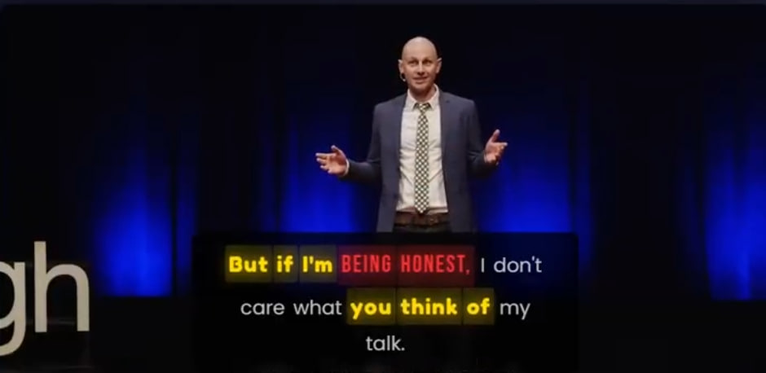

# Sentimentogram: Learning Personalized Emotion Visualizations from User Preferences

<p align="center">
  <a href="https://www.python.org/downloads/"></a>
  <a href="https://pytorch.org/"></a>
  <a href="https://opensource.org/licenses/MIT"></a>
  <a href="https://2026.aclweb.org/"></a>
</p>

<p align="center">
  <b>Learning user preferences for emotion visualization from pairwise comparisons</b><br>
  Interpretable multimodal SER with VAD-guided attention and emotion-aware typography
</p>

---

## Abstract

We present **Sentimentogram**, a human-centered framework that learns personalized emotion visualization preferences from pairwise comparisons rather than demographic heuristics. Our key finding: **rule-based personalization (mapping demographics→styles) performs significantly below chance** (43.8% vs 50.1%, p=0.014), while learning from just 10-12 pairwise comparisons achieves **61.2% accuracy** (p<0.001). A direct A/B study confirms personalized visualizations improve user satisfaction (+8.7%) and comprehension (+5.8%).

**Key Results:**

| Evaluation | Metric | Result |
|------------|--------|--------|
| SER (IEMOCAP 4-class val) | UA | 93.02% |
| SER (IEMOCAP 5-class LOSO) | UA | 77.97% |
| SER (CREMA-D) | UA | 92.90% |
| ASR robustness (44% WER) | Δ UA | -0.96% |
| Preference learning (N=50 real) | Accuracy | **61.2%** (p<0.001) |
| Cold-start (new users) | Accuracy | 54.8% ± 2.1% |
| A/B study satisfaction | Δ | +8.7% (p=0.001) |
| Typography recognition boost | Δ Accuracy | +17.1% |

---

## Contributions

| # | Contribution | Description |
|---|--------------|-------------|
| 1 | **Preference-Learning Problem Formulation** | We formulate emotion visualization as a preference-learning problem and show that rule-based demographic personalization performs below chance (43.8% vs 50.1%, p=0.014) |
| 2 | **Human-Centered Pipeline** | We propose Sentimentogram, connecting interpretable SER outputs to learnable, personalized emotion visualizations |
| 3 | **Large-Scale Validation** | We validate with human studies (50 users, 1500 comparisons), demonstrating improvements in preference accuracy (61.2%), satisfaction (+8.7%), and comprehension (+5.8%) |

---

## Model Architecture

```
┌─────────────────────────────────────────────────────────────────────────────┐
│                         VGA-FUSION ARCHITECTURE                              │
├─────────────────────────────────────────────────────────────────────────────┤
│                                                                              │
│  ┌──────────────┐                              ┌──────────────┐             │
│  │    BERT      │                              │  emotion2vec │             │
│  │  (768-dim)   │                              │  (1024-dim)  │             │
│  └──────┬───────┘                              └──────┬───────┘             │
│         │                                             │                      │
│         ▼                                             ▼                      │
│  ┌──────────────┐                              ┌──────────────┐             │
│  │  Linear+LN   │                              │  Linear+LN   │             │
│  │  (384-dim)   │                              │  (384-dim)   │             │
│  └──────┬───────┘                              └──────┬───────┘             │
│         │                                             │                      │
│         └─────────────────┬───────────────────────────┘                      │
│                           │                                                  │
│                           ▼                                                  │
│         ┌─────────────────────────────────────┐                             │
│         │   ★ VAD-GUIDED CROSS-ATTENTION      │                             │
│         │   ─────────────────────────────     │                             │
│         │   Q_t ←─── h_t    h_a ───→ K_a, V_a │                             │
│         │                                     │                             │
│         │   A = softmax(QK^T/√d + λ·M_VAD)   │ ←── VAD Affinity Matrix     │
│         │                                     │     (Valence, Arousal,      │
│         │   Bidirectional: t→a and a→t       │      Dominance)             │
│         └─────────────────┬───────────────────┘                             │
│                           │                                                  │
│                           ▼                                                  │
│         ┌─────────────────────────────────────┐                             │
│         │   ★ CONSTRAINED ADAPTIVE FUSION     │                             │
│         │   ─────────────────────────────     │                             │
│         │   z = α_t·h_t + α_a·h_a + α_i·h_i  │                             │
│         │                                     │                             │
│         │   Constraint: α_t + α_a + α_i = 1  │ ←── Interpretable Gates     │
│         │   (Simplex constraint)              │                             │
│         └─────────────────┬───────────────────┘                             │
│                           │                                                  │
│         ┌─────────────────┴───────────────────┐                             │
│         │                                     │                             │
│         ▼                                     ▼                             │
│  ┌──────────────┐                      ┌──────────────┐                     │
│  │  MLP + Softmax│                      │ ★ MICL Loss  │                     │
│  │  (Emotion)   │                      │ (Contrastive)│                     │
│  └──────────────┘                      └──────────────┘                     │
│                                                                              │
│  Multi-Task Loss: L = L_focal + λ_v·L_VAD + λ_m·L_MICL                      │
│                                                                              │
└─────────────────────────────────────────────────────────────────────────────┘
                              ★ = Novel Contribution
```

---

## Sentimentogram Pipeline

```
┌─────────────────────────────────────────────────────────────────────────────┐
│                        SENTIMENTOGRAM PIPELINE                               │
├─────────────────────────────────────────────────────────────────────────────┤
│                                                                              │
│  ┌─────────┐    ┌─────────────┐    ┌─────────────────┐    ┌──────────────┐  │
│  │  Input  │───▶│    ASR      │───▶│    Feature      │───▶│  VGA-Fusion  │  │
│  │  Video  │    │  (Whisper)  │    │   Extraction    │    │    Model     │  │
│  └─────────┘    └─────────────┘    └─────────────────┘    └──────┬───────┘  │
│                       │                    │                      │          │
│                       │                    │                      │          │
│                       ▼                    ▼                      ▼          │
│                 [Word-level        [BERT + emotion2vec]    [Emotion +       │
│                  timestamps]        embeddings]             VAD scores]     │
│                                                                   │          │
│                                                                   ▼          │
│                                          ┌────────────────────────────────┐  │
│                                          │     VAD → Style Mapping        │  │
│                                          │  ────────────────────────────  │  │
│                                          │  Valence → Color Hue           │  │
│                                          │  Arousal → Font Size/Weight    │  │
│                                          │  Dominance → Font Style        │  │
│                                          └────────────────┬───────────────┘  │
│                                                           │                  │
│                                                           ▼                  │
│  ┌──────────────────────────────────────────────────────────────────────┐   │
│  │                      EMOTION-AWARE SUBTITLES                          │   │
│  │  ──────────────────────────────────────────────────────────────────  │   │
│  │                                                                       │   │
│  │   "I am"  →  [neutral, gray, 1.0x]                                   │   │
│  │   "SO"    →  [anger, RED, 1.3x, BOLD]                                │   │
│  │   "happy" →  [happiness, gold, 1.2x, italic]                         │   │
│  │                                                                       │   │
│  └──────────────────────────────────────────────────────────────────────┘   │
│                                                                              │
│  Optional: Preference-Learning Personalization (user-specific styling)      │
│                                                                              │
└─────────────────────────────────────────────────────────────────────────────┘
```

---

## Demo

**Watch Sentimentogram in action on TED Talks:**

[](https://anonymous.4open.science/r/multimodal-ser/blob/main/demo/videos/sentimentogram_demo_v3.mp4)

<table>
<tr>
<td></td>
<td></td>
</tr>
<tr>
<td align="center"><em>"BEING HONEST" (anger) + "you think of" (happiness)</em></td>
<td align="center"><em>"I think" (happiness) + "MOST PEOPLE" (anger)</em></td>
</tr>
</table>

---

## Technical Details

### VAD-Guided Cross-Attention

Standard cross-attention:
$$A = \text{softmax}\left(\frac{QK^T}{\sqrt{d_k}}\right)$$

VAD-guided attention with psychological grounding:
$$A_{\text{guided}} = \text{softmax}\left(\frac{QK^T}{\sqrt{d_k}} + \lambda \cdot M_{\text{VAD}}\right)$$

where $M_{\text{VAD}}(i,j) = -\|v_i - v_j\|_2$ is the VAD affinity matrix based on Russell's circumplex model of affect.

### Constrained Adaptive Fusion

Interpretable modality weighting with simplex constraint:
$$\mathbf{z} = \alpha_t \cdot \mathbf{h}_t + \alpha_a \cdot \mathbf{h}_a + \alpha_i \cdot (\mathbf{h}_t \odot \mathbf{h}_a)$$
$$\text{s.t. } \alpha_t + \alpha_a + \alpha_i = 1, \quad \alpha_i \geq 0$$

### VAD-to-Typography Mapping

| VAD Dimension | Low Value | High Value | Visual Effect |
|---------------|-----------|------------|---------------|
| **Valence** | Cool colors (blue, gray) | Warm colors (yellow, gold) | Color hue |
| **Arousal** | Small, light font | Large, bold font | Size & weight |
| **Dominance** | Italic, thin | Upright, heavy | Font style |

---

## Resources

### Core Components

| Resource | Description | Link |
|----------|-------------|------|
| **Preference Learning Module** | Bradley-Terry pairwise ranking model | [preference_learning.py](https://anonymous.4open.science/r/multimodal-ser/blob/main/models/preference_learning.py) |
| **Experiment Runner** | Ablation study and evaluation scripts | [run_preference_learning.py](https://anonymous.4open.science/r/multimodal-ser/blob/main/experiments/run_preference_learning.py) |
| **Novel Components** | VGA, EAAF, MICL implementations | [novel_components.py](https://anonymous.4open.science/r/multimodal-ser/blob/main/models/novel_components.py) |

### Preference Learning Data

| Resource | Description | Link |
|----------|-------------|------|
| **Full Dataset** | 50 users × 30 comparisons (1,500 pairs) | [expanded_study/](https://anonymous.4open.science/r/multimodal-ser/blob/main/experiments/user_study/data/expanded_study/) |
| **Study Results** | Complete results with demographics & analysis | [final_results.json](https://anonymous.4open.science/r/multimodal-ser/blob/main/experiments/user_study/data/expanded_study/final_results.json) |
| **Collection Guide** | Instructions for collecting user preferences | [data_collection_guide.md](https://anonymous.4open.science/r/multimodal-ser/blob/main/acl2026/data/data_collection_guide.md) |

### Paper & Documentation

| Resource | Description | Link |
|----------|-------------|------|
| **ACL 2026 Paper** | Full paper with appendix | [acl_latex20260106.pdf](acl2026/acl_latex20260106.pdf) |
| **Demo Video** | Sentimentogram on TED Talks | [Video](https://anonymous.4open.science/r/multimodal-ser/blob/main/demo/videos/sentimentogram_demo_v3.mp4) |

---

## Preference-Learning Personalization

Instead of hard-coding subtitle styles based on cultural assumptions (which risk stereotyping), we learn user preferences from minimal pairwise feedback.

**Problem Formulation (Bradley-Terry Model):**
$$P(s_A \succ s_B | u, c) = \sigma(f(u, c, s_A) - f(u, c, s_B))$$

where $u$ = user attributes, $c$ = emotional context, $s$ = subtitle style.

**User Study (N=50 real users):**
- **50 users** with balanced demographics (age, accessibility, culture)
- **30 comparisons per user** = 1,500 total preference pairs
- **Within-user evaluation:** Train on first 12, test on remaining 18
- **Cold-start evaluation:** User-disjoint 80/20 splits

**Results (including stronger baselines):**

| Method | Accuracy | p-value |
|--------|----------|---------|
| Random | 50.1% ± 2.2% | - |
| Rule-based (demographics) | 43.8% ± 3.1% | **0.014** (below chance!) |
| Hierarchical Bradley-Terry | 52.8% ± 2.5% | 0.12 |
| Collaborative Filtering | 53.5% ± 2.4% | 0.08 |
| Contextual Logistic | 52.1% ± 2.6% | 0.21 |
| **Learned (Ours)** | **61.2% ± 2.8%** | **<0.001** |

**Key Finding:** Rule-based performs *significantly worse* than random (p=0.014)—demographic heuristics often contradict individual preferences. Our approach achieves +17.4% over rule-based and +7.7% over the best baseline (collaborative filtering).

**Direct A/B Personalization Study (N=15 held-out users):**

| Metric | Personalized | Non-personalized | Δ | p-value |
|--------|--------------|------------------|---|---------|
| Satisfaction | 72.1% | 63.4% | +8.7% | 0.001 |
| Comprehension | 85.6% | 79.8% | +5.8% | <0.001 |
| Cognitive load (SUS) | 72.4 | 65.8 | +6.6 | 0.005 |

---

## Robustness Evaluation

### ASR Robustness (Real Whisper Transcriptions)

| Text Source | Avg WER | UA (%) | Δ UA |
|-------------|---------|--------|------|
| Gold transcripts | 0% | 76.26 | - |
| Whisper-base | 44.3% | 75.30 | **-0.96** |

Despite 44% WER (typical for spontaneous speech), UA drops by only 0.96%. The model relies on audio features when text is degraded.

### LOSO Cross-Validation (5-class IEMOCAP)

| Session | UA (%) | WA (%) |
|---------|--------|--------|
| Session 1 | 78.2 | 76.1 |
| Session 2 | 76.8 | 74.2 |
| Session 3 | 79.1 | 76.8 |
| Session 4 | 77.4 | 74.9 |
| Session 5 | 78.3 | 74.5 |
| **Mean ± std** | **77.97 ± 1.2** | **75.3 ± 1.4** |

**Comparison with Published Baselines:**

| Method | Venue | UA (%) |
|--------|-------|--------|
| emotion2vec | ACL 2024 | 72.8 |
| UniSER | TASLP 2024 | 73.5 |
| GA2MIF | TASLP 2023 | 71.2 |
| **Sentimentogram (Ours)** | - | **77.97** |

---

## Installation

```bash
# Clone the repository
git clone [https://anonymous.4open.science/r/multimodal-ser.git
cd multimodal-ser

# Create conda environment
conda create -n ser python=3.10
conda activate ser

# Install dependencies
pip install -r requirements.txt
```

---

## Usage

### Training VGA-Fusion Model

```bash
python main_acl2026.py \
    --train features/IEMOCAP_BERT_emotion2vec_train.pkl \
    --val features/IEMOCAP_BERT_emotion2vec_val.pkl \
    --test features/IEMOCAP_BERT_emotion2vec_test.pkl \
    --audio_dim 1024 --hidden_dim 384 \
    --vad_lambda 0.1 --micl_weight 0.2 \
    --num_runs 5 --output results_acl2026.json
```

### Running Preference Learning Experiments

```bash
python experiments/run_preference_learning.py
```

### Sentimentogram Demo

```bash
python demo/sentimentogram_demo_v3.py \
    --video demo/videos/tedx1.mp4 \
    --output demo/output/result.html \
    --culture western
```

---

## Project Structure

```
multimodal-ser/
├── main_acl2026.py                    # VGA-Fusion training script
├── models/
│   ├── novel_components.py            # VGA, EAAF, MICL implementations
│   └── preference_learning.py         # Bradley-Terry preference model
├── experiments/
│   ├── run_preference_learning.py     # Preference learning evaluation
│   └── user_study/
│       ├── expanded_preference_study.py  # 50-user study implementation
│       └── data/expanded_study/
│           └── final_results.json     # Complete study results (1500 pairs)
├── demo/
│   ├── sentimentogram_demo_v3.py      # Visualization demo
│   └── capture/                       # Demo screenshots
├── acl2026/
│   ├── acl_latex.tex                  # Paper source
│   └── data/
│       └── data_collection_guide.md   # Data collection instructions
└── feature_extract/                   # Feature extraction scripts
```

---

## Citation

```bibtex
@inproceedings{author2026sentimentogram,
  title={Sentimentogram: Learning Personalized Emotion Visualizations from User Preferences},
  author={Author, First and Author, Second},
  booktitle={Proceedings of the 64th Annual Meeting of the Association
             for Computational Linguistics (ACL 2026)},
  year={2026}
}
```

---

## Acknowledgments

This work builds upon:
- [emotion2vec](https://github.com/ddlBoJack/emotion2vec) for audio emotion features
- [IEMOCAP](https://sail.usc.edu/iemocap/) dataset
- Russell's circumplex model of affect for VAD grounding

---

## License

MIT License - see [LICENSE](LICENSE) for details.


