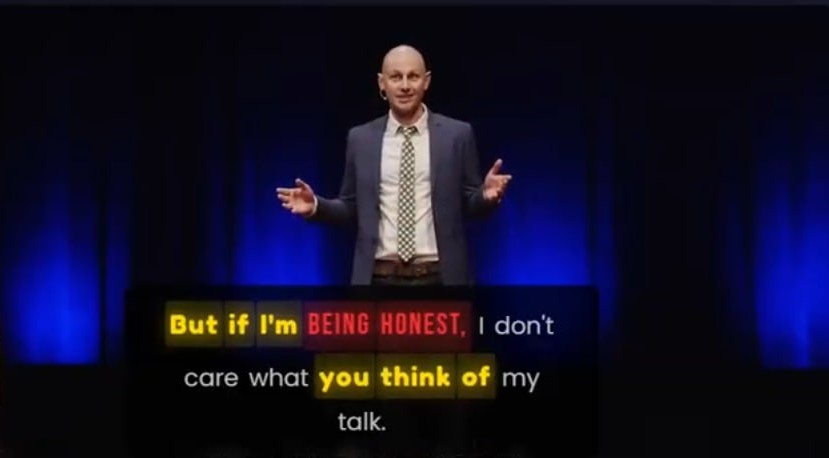
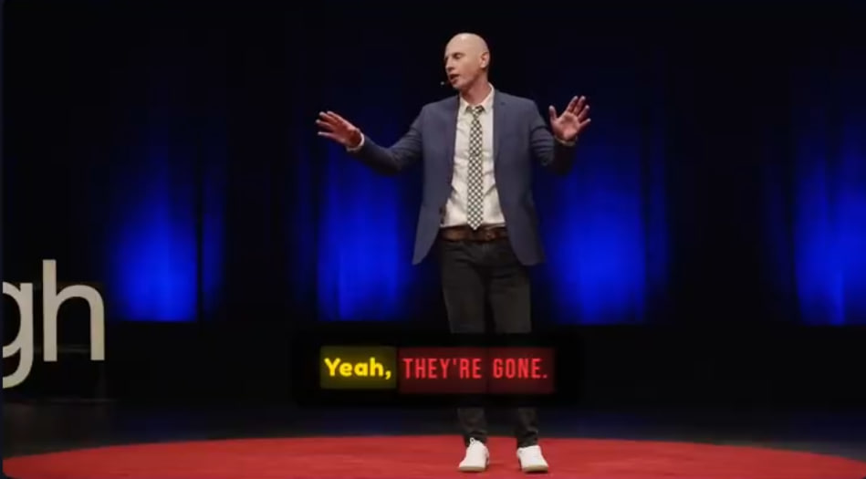
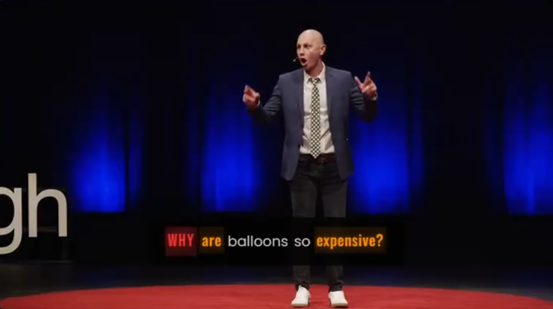
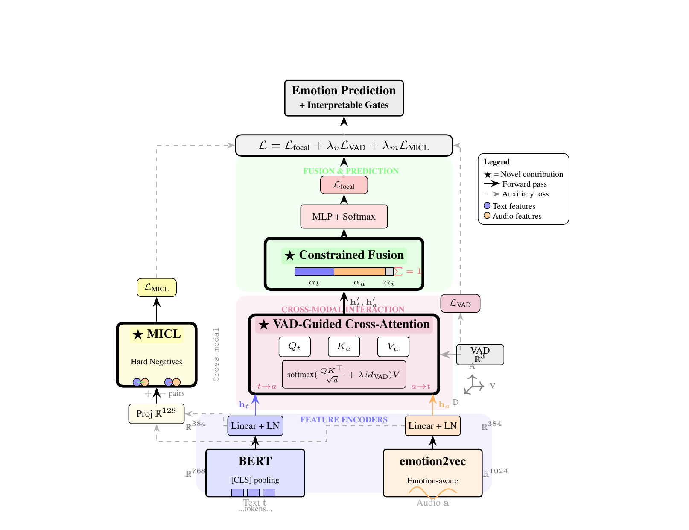
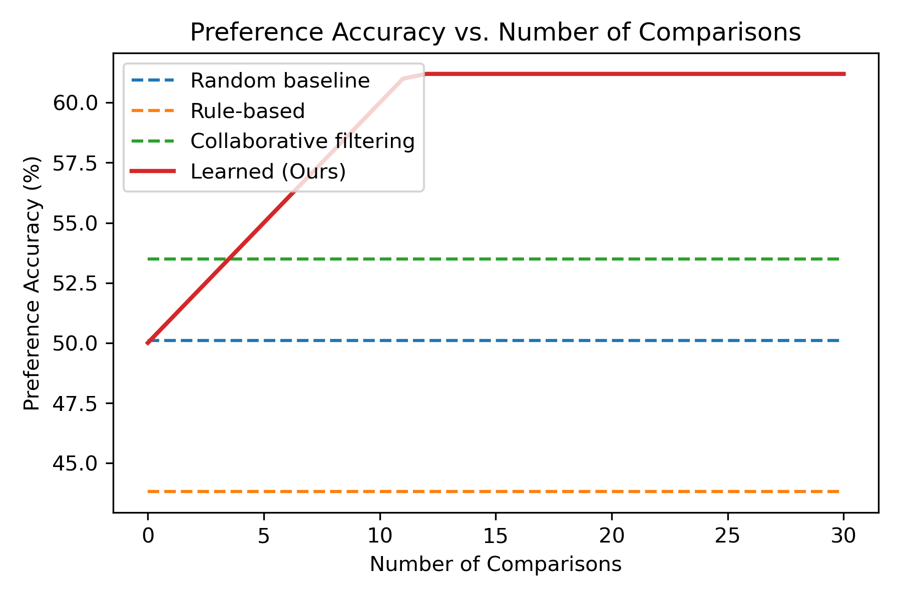
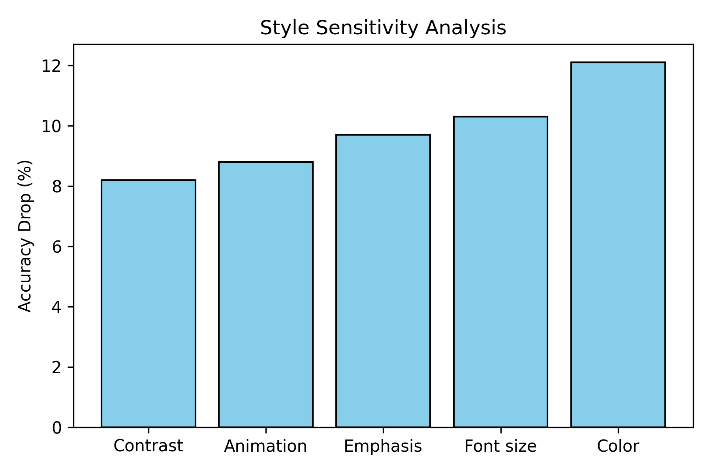

# Sentimentogram: Learning Personalized Emotion Visualizations from User Preferences

<p align="center">
  <a href="https://openreview.net/forum?id=CivSckXgby"></a>
  <a href="https://github.com/muxiddin19/multimodal-ser/blob/main/LICENSE"></a>
  
  
  <a href="https://github.com/muxiddin19/multimodal-ser/stargazers"></a>
</p>

<p align="center">
  <a href="https://openreview.net/forum?id=CivSckXgby">📄 Paper (ACL 2026)</a> &nbsp;•&nbsp;
  <a href="https://drive.google.com/file/d/1jCsz9mba0D7AxjaY1RV1uYc8XR9xeqy7/view">🎥 Demo Video</a> &nbsp;•&nbsp;
  <a href="#dataset--model-release">📦 Dataset & Models</a> &nbsp;•&nbsp;
  <a href="#citation">📖 Citation</a>
</p>

> **Accepted at Findings of ACL 2026**
> Mukhiddin Toshpulatov · Seungkyu Oh · Suan Lee · Jo'ra Kuvandikov · Wookey Lee
> Gachon University · Inha University · Semyung University · Jizzakh branch of NUUz

---

## Overview

Current speech emotion recognition (SER) systems produce predictions that users cannot interpret, visualize, or personalize — limiting real-world adoption. **Sentimentogram** is a human-centered framework that learns personalized emotion visualization preferences from pairwise comparisons rather than relying on demographic-based heuristics.

**Key finding:** Rule-based demographic adaptation performs **significantly below chance** (43.8% vs 50.1%, *p*=0.014). Learning from just 10–12 pairwise comparisons (~3 minutes of user effort) achieves **61.2% accuracy** (+7.7% over the best baseline, *p*<0.001), with A/B study confirming improved satisfaction (+8.7%) and comprehension (+5.8%).

---

## Sentimentogram in Action

Real examples from our TED Talk demo — every subtitle is styled in real time based on the predicted emotion of that utterance.

<p align="center">
  
  &nbsp;
  
</p>
<p align="center">
  
  &nbsp;
  
</p>

<details>
<summary><b>Typography legend</b></summary>

| Emotion | Font style | Color | Size |
|---|---|---|---|
| **Anger** | Bold uppercase | Red | 1.3x |
| **Happy** | Bouncy | Gold | 1.15x |
| **Sad** | *Italic* | Blue | 0.92x |
| **Neutral** | Regular | Gray | 1.0x |

Colors map to the Valence-Arousal-Dominance (VAD) space (Russell, 1980). All colors meet WCAG 2.1 AA contrast standards.
</details>

📹 **[Watch the full demo video](https://drive.google.com/file/d/1jCsz9mba0D7AxjaY1RV1uYc8XR9xeqy7/view)**

---

## Pipeline

```
Video Input
    |
    v
[Whisper ASR]  -->  [BERT + emotion2vec]  -->  [VGA-Fusion (SER)]  -->  [Sentimentogram Renderer]
 + Segmentation      384d shared space         77.97% UA                + Personalization
                                                    |
                                          alpha_t + alpha_a + alpha_i = 1
                                          "76% audio, 24% text" per utterance
```

Each stage enables the next: **accurate SER** -> **interpretable fusion** -> **meaningful visualization** -> **learned personalization**.

---

## Model: VGA-Fusion

### Architecture

<p align="center">
  
</p>

```
Text:  BERT-base (768d)    --> Linear+LN (384d) --+
                                                  +--> VAD-Guided Cross-Attention --> Constrained Fusion --> Classifier
Audio: emotion2vec (1024d) --> Linear+LN (384d) --+         ^                              ^
                                                   VAD affinity bias            alpha_t + alpha_a + alpha_i = 1
```

### VAD-Guided Cross-Attention

```
VGA(Q, K, V) = softmax( QK^T / sqrt(d)  +  lambda * M_VAD ) * V

M_VAD(i,j) = -|| v_t^(i) - v_a^(j) ||_2     (pairwise VAD affinity)
```

Provides psychologically grounded regularization using the Valence-Arousal-Dominance model.
Learned VAD projections correlate with NRC-VAD lexicon values (r=0.81 valence, r=0.74 arousal).

### Constrained Adaptive Fusion

```
[alpha_t, alpha_a, alpha_i] = softmax( W_g * [h_t ; h_a ; h_t o h_a] )

h_fused = alpha_t * h_t  +  alpha_a * h_a  +  alpha_i * (h_t o h_a)
                                      s.t.  alpha_t + alpha_a + alpha_i = 1
```

Per-sample interpretation: if alpha_a = 0.76, audio contributes exactly **76%** to that prediction.

### Training Objective

```
L = L_focal  +  lambda_micl * L_MICL  +  lambda_vad * L_VAD
```

---

## Results

### Speech Emotion Recognition

| Dataset | Protocol | UA (%) |
|---|---|---|
| IEMOCAP 4-class | Validation | 93.02 +/- 0.17 |
| IEMOCAP 5-class | Validation | **77.97 +/- 0.33** |
| IEMOCAP 5-class | LOSO (5-fold) | 75.3 +/- 1.1 |
| IEMOCAP 6-class | Validation | 68.75 +/- 0.58 |
| CREMA-D | Validation | 92.90 +/- 0.34 |
| MELD | Validation | 63.66 +/- 0.72 |

### Preference Learning

| Method | Accuracy | p-value |
|---|---|---|
| Random | 50.1 +/- 2.2% | -- |
| Rule-based (demographic) | 43.8 +/- 3.1% | 0.014 (**below chance**) |
| Collaborative filtering | 53.5 +/- 2.4% | 0.08 |
| Hierarchical Bradley-Terry | 52.8 +/- 2.5% | 0.12 |
| **Learned (Ours)** | **61.2 +/- 2.8%** | **<0.001** |

### Preference Accuracy vs. Number of Comparisons

<p align="center">
  
</p>

Our approach saturates at **~12 comparisons (~3 minutes)**. The rule-based demographic approach stays **below the random baseline** throughout — confirming that demographic stereotypes actively harm personalization.

### Style Dimension Sensitivity

<p align="center">
  
</p>

All five style dimensions contribute to preference prediction. **Color is most discriminative** (-12.1% when removed), followed by font size (-10.3%), emphasis (-9.7%), animation (-8.8%), and contrast (-8.2%).

### ASR Robustness

At 44.3% WER (Whisper on spontaneous speech), UA drops by only **-0.96%** — multimodal fusion automatically shifts weight toward audio when transcription quality degrades.

---

## Dataset & Model Release

### Preference Dataset

**1,500 pairwise style comparisons** from 50 real users across 6 emotion categories.
Collected under IRB Protocol #2024-0847 with informed consent; no personally identifying information released.

> Dataset: `data/preference_dataset/` *(upload in progress — available before April 19, 2026)*

**Demographics:** Age groups (18-65+), accessibility needs (low vision, color blind, dyslexia, hearing impaired), cultural backgrounds (Western, East Asian, South Asian, Middle Eastern, African, Latin American).

Each record: user profile vector + two 5-dimensional style vectors + binary preference label.

### Pre-trained Models

> Models: *(upload in progress — available before April 19, 2026)*

| Model | Dataset | UA (%) | Download |
|---|---|---|---|
| VGA-Fusion | IEMOCAP 5-class | 77.97 | Coming soon |
| VGA-Fusion | CREMA-D | 92.90 | Coming soon |
| Preference model | 50-user study | 61.2 | Coming soon |

---

## Installation

```bash
git clone https://github.com/muxiddin19/multimodal-ser.git
cd multimodal-ser
conda create -n sentimentogram python=3.10
conda activate sentimentogram
pip install -r requirements.txt
```

**Requirements:** Python 3.10+, PyTorch 2.5+, `transformers`, `emotion2vec-plus-large`, `openai-whisper`

---

## Usage

### Train VGA-Fusion (SER)

```bash
python main_acl2026.py \
  --dataset iemocap --num_classes 5 \
  --hidden_dim 384 --num_heads 8 --k_views 4 \
  --vad_lambda 0.5 --micl_weight 0.3 \
  --epochs 100 --lr 2e-5 --batch_size 16 --seed 42
```

### Run Preference Learning

```bash
python experiments/preference_learning.py \
  --data_path data/preference_dataset/ \
  --eval_mode within_user \
  --train_comparisons 12 --test_comparisons 18
```

### Run Sentimentogram Demo (video subtitling)

```bash
python demo/sentimentogram_demo.py \
  --video_path your_video.mp4 \
  --model_path models/vga_fusion_iemocap5.pt \
  --user_profile data/user_profiles/example.json \
  --output_path output_styled.mp4
```

---

## Project Structure

```
multimodal-ser/
├── main_acl2026.py              # VGA-Fusion training entry point
├── requirements.txt
├── run_all_experiments.sh       # Reproduce all paper results
├── models/
│   ├── vga_fusion.py            # VAD-Guided Cross-Attention + Constrained Fusion
│   ├── micl.py                  # Supervised Contrastive MICL
│   └── preference_model.py      # Bradley-Terry preference learning
├── experiments/
│   ├── preference_learning.py
│   ├── typography_eval.py
│   └── ablation_study.py
├── feature_extract/
│   ├── bert_extractor.py
│   └── emotion2vec_extractor.py
├── demo/
│   ├── sentimentogram_demo.py
│   └── capture/                 # Screenshot examples
├── data/
│   └── preference_dataset/      # 1,500 pairwise comparisons (50 users)
└── assets/                      # README figures
    ├── learning_curve.png
    ├── style_sensitivity.png
    └── sentimentogram_*.jpg
```

---

## Reproducing Paper Results

```bash
bash run_all_experiments.sh
```

Key hyperparameters (full table in paper Appendix A):

| Parameter | Value |
|---|---|
| Hidden dimension | 384 |
| Attention heads | 8 |
| K views | 4 |
| VAD guidance lambda | 0.5 |
| MICL weight | 0.3 |
| VAD loss weight | 0.5 |
| Focal loss gamma | 2.0 |
| Learning rate | 2e-5 |
| Batch size | 16 |
| Early stopping patience | 15 |
| Runs per experiment | 5 (mean +/- std) |

---

## Citation

```bibtex
@inproceedings{toshpulatov2026sentimentogram,
  title     = {Sentimentogram: Learning Personalized Emotion Visualizations from User Preferences},
  author    = {Toshpulatov, Mukhiddin and Oh, Seungkyu and Lee, Suan and Kuvandikov, Jo'ra and Lee, Wookey},
  booktitle = {Findings of the Association for Computational Linguistics: ACL 2026},
  year      = {2026},
  publisher = {Association for Computational Linguistics},
  url       = {https://openreview.net/forum?id=CivSckXgby}
}
```

---

## Acknowledgments

This work was supported by:
- **IITP-ITRC** grant, Korea government (MSIT), XVoice (RS-2022-II220641)
- **National Research Foundation of Korea (NRF)** (RS-2025-24534935)
- **Inha University**

We thank the IEMOCAP team (USC), CREMA-D and MELD contributors. Audio features use [emotion2vec](https://github.com/ddlBoJack/emotion2vec) (Ma et al., 2024). VAD grounding uses the [NRC-VAD lexicon](https://saifmohammad.com/WebPages/nrc-vad.html) (Mohammad, 2018).

---

## Ethics

Studies conducted under IRB Protocol #2024-0847 with informed consent. No personally identifying information in released data. We encourage deployment only in transparent, opt-in settings with explicit user control. See the paper Ethics Statement for full details.

---

## License

[MIT License](LICENSE)
